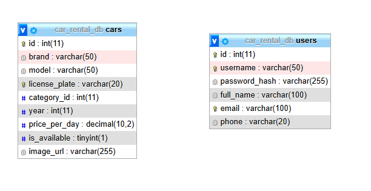

# Rendszerterv
## 1. A rendszer célja
Az alkalmazás célja egy egyszerűen kezelhető, grafikus felülettel rendelkező kocsi kereskedés szimulálása, amely lehetővé teszi a felhasználók számára, hogy megtekinthessék a kereskedésben elérhető autókat, új járműveket adhassanak hozzá, meglévő járműveket szerkeszthessenek vagy törölhessenek, valamint vásárlásokat szimulálhassanak.
A rendszer egy modern, digitális járműkereskedői megoldást kínál, amely segíti a kisebb autókereskedéseket abban, hogy átláthatóan és hatékonyan kezelhessék kínálatukat.
## 2. Projektterv

### 2.1 Projektszerepkörök, felelőségek:
  * Üzleti szereplő:
	  -   Megrendelő:
		  -  Herbák Marcell
     
### 2.2 Projektmunkások és felelőségek:
   * Frontend és backend:
     - Bobák Martin
     - Horváth Medárd
   * Tesztelés:
     - Bobák Martin
     - Horváth Medárd
     
### 2.3 Ütemterv:

|Funkció                  | Feladat                                | Prioritás | Becslés (nap) | Aktuális becslés (nap) | Eltelt idő (nap) | Becsült idő (nap) |
|-------------------------|----------------------------------------|-----------|---------------|------------------------|------------------|---------------------|
|Rendszerterv             |Megírás                                 |         1 |             1 |                      1 |                1 |                   1 |
|Program                  |Prototípus elkészítése                  |         2 |             5 |                      5 |                3 |                   3 |
|Program                  |Tesztelés                               |         3 |             2 |                      2 |                1 |                   1 |

### 2.4 Mérföldkövek:
   *   04.05. Projekt elkezdése
   *   04.09. Dokumentáció elkészítése
   *   04.11. Béta verzió elkészítése
   *   04.12. Végleges prototípus elkészítése
   *   04.12. Tesztelés
   *   04.13. Bemutatás és átadás

## 3. Üzleti folyamatok modellje

### 3.1 Üzleti szereplők
Az alkalmazás használata regisztrációhoz kötött. A felhasználók kétféle jogosultsággal rendelkezhetnek:

* Adminisztrátor: teljes hozzáféréssel rendelkezik az autók adatainak kezeléséhez (hozzáadás, szerkesztés, törlés), valamint vásárlás szimulálásához.

* Felhasználó: megtekintheti az autók listáját és szimulált vásárlásokat hajthat végre, de nem módosíthatja a járművek adatait.

### 3.2 Üzleti folyamatok
Az alkalmazás indulását követően a felhasználó bejelentkezik a megfelelő hitelesítő adatokkal. A bejelentkezés alapján eltérő funkciók válnak elérhetővé:
- Adminisztrátorok által elérhető funkciók:
     - Új autó hozzáadása (márka, modell, évjárat, ár megadásával).
     - Meglévő autó adatainak módosítása (például ár vagy évjárat szerkesztése).
     - Autó törlése a kínálatból.
     - Vásárlási folyamat szimulálása.
     - Eladott autók listájának megtekintése.
- Felhasználók által elérhető funkciók:
	- Autók listájának megtekintése (márka, modell, évjárat, ár adatokkal).
	- Vásárlás szimulációja: autó kiválasztása és megvásárlása (az autó eltávolítása a kínálatból vagy áthelyezése eladott listára).
- Általános folyamatok:
  - Bejelentkezés a rendszerbe a felhasználónév és jelszó megadásával.
  - Kilépés az alkalmazásból.

## 4. Követelmények

### Funkcionális követelmények

| ID  | Megnevezés                | Leírás                                                                                                        |
|-----|----------------------------|---------------------------------------------------------------------------------------------------------------|
| K1  | Bejelentkezési felület      | A felhasználónak az alkalmazás elérése előtt azonosítania kell magát (felhasználónév és jelszó megadásával).   |
| K2  | Autók megjelenítése         | A felhasználók megtekinthetik a kereskedésben elérhető autókat a részletes adatokkal (márka, modell, évjárat, ár). |
| K3  | Új autó hozzáadása          | Az adminisztrátor új autókat adhat hozzá a kínálathoz az adatok megadásával.                                   |
| K4  | Autó adatainak módosítása   | Az adminisztrátor módosíthatja a meglévő autók adatait (pl. ár, évjárat).                                       |
| K5  | Autó törlése                | Az adminisztrátor törölhet autókat a rendszerből.                                                              |
| K6  | Vásárlás szimulációja       | A felhasználók autókat vásárolhatnak szimulált módon, amely eltávolítja az autót a kínálatból vagy áthelyezi egy eladott listára. |
| K7  | Eladott autók megtekintése  | Az adminisztrátor megtekintheti az eladott autók listáját.                                                     |

### Nemfunkcionális követelmények

| ID  | Megnevezés                          | Leírás                                                                                   |
|-----|-------------------------------------|------------------------------------------------------------------------------------------|
| N1  | Átlátható, könnyen kezelhető felület | A felületek intuitívak legyenek, a felhasználó könnyen eligazodjon az alkalmazásban.      |
| N2  | Jogosultságkezelés                  | A rendszer különböztesse meg az adminisztrátorokat és a felhasználókat jogosultságok szerint. |
| N3  | Tervezési minták használata         | Az alkalmazás kódja legalább három tervezési mintát tartalmazzon (Singleton, Factory, Observer). |
| N4  | Stabilitás és hibakezelés           | Az alkalmazás megbízhatóan működjön, és megfelelően kezelje a hibás adatbeviteleket vagy egyéb hibákat. |

### Támogatott eszközök

- Bármely Java alkalmazás futtatására alkalmas eszköz, például Windows operációs rendszerrel rendelkező számítógép.
- Ajánlott minimum követelmények:
  - Windows 10 vagy újabb operációs rendszer
  - Legalább 4 GB RAM
  - Legalább 1 GHz-es processzor
- JavaFX támogatás szükséges a grafikus felület futtatásához.

## 5. Funkcionális terv

### 5.1 Rendszerszereplők
 - Felhasználó
   - Tétet tehet meg, és játszhat a játékmódokkal
 - "Gép"
   - Sorsolja az eredményeket

### 5.2 Menühierarchiák
- Főoldal (Bejelentkezés és Regisztráció)
- Pénzfeldobó játék
- Dobókocka játék

## 6. Fizikai környezet

### Vásárolt szoftverkomponensek, valamint esetleges külső rendszerek
- A rendszer fejlesztéséhez és működéséhez nem szükségesek kereskedelmi szoftverkomponensek.

### Hardver topológia
A rendszer működtetéséhez olyan számítógép szükséges, amely rendelkezik legalább az alábbiakkal:
- Windows 10 vagy Windows 11 operációs rendszer
- Legalább 4 GB RAM, ajánlott 8 GB
- Legalább 1 GHz-es processzor, ajánlott 2+ magos CPU
- Helyi hálózati vagy internetkapcsolat, ha a MySQL adatbázis távoli gépen fut

### Fizikai alrendszerek
Kliens gépek:
- Felhasználói oldalon Windows 10/11 operációs rendszerrel rendelkező számítógépek, amelyeken a WPF alkalmazás fut. A kliens közvetlenül kapcsolódik a szerver gépen elérhető MySQL adatbázishoz.

Szerver (Host) gép:
- A MySQL adatbázist kiszolgáló gép. Ez lehet egy különálló gép a hálózaton, vagy akár egy kliensgépen lokálisan futtatott adatbázis is. A szerver biztosítja az adatok központi tárolását és elérhetőségét.

### Fejlesztő eszközök
- Visual Studio 2022 Community Edition – a WPF alkalmazás fejlesztésére
- MySQL Workbench – az adatbázis tervezésére és kezelésére
- MySQL Server – az adatbázis kiszolgálásához
- MySQL Connector/NET – a WPF alkalmazás adatbáziskapcsolatához
- Git + GitHub – verziókezeléshez

## 8. Architekturális terv

### Webszerver
- A rendszer nem igényel külön webszervert, mivel egy WPF alapú asztali alkalmazásról van szó.

### Adatbázis rendszer
- MySQL alapú adatbázis rendszer, amelyhez az alkalmazás a MySQL Connector for .NET segítségével kapcsolódik.

### A program elérése, kezelése
- A WPF-alapú asztali alkalmazás közvetlenül kapcsolódik a MySQL-adatbázishoz.

- A fejlesztéshez Visual Studio és .NET 6 vagy újabb szükséges.

- Az adatbázis eléréshez szükséges MySQL Connector és a megfelelő connection string konfigurálása.

## 9. Adatbázis terv

## 10. Implementációs terv
A projekt két fő részre oszlik: a frontendre és a backendre.
Frontend: A WPF technológiát használja, XAML alapú nézetekkel és MVVM architektúrával.
Backend: A .NET keretrendszer segítségével készült adatkezelő réteg valósítja meg az adatbázis-műveleteket, beleértve az autók, bérlések, felhasználók kezelését.
A forráskódban egységesen az angol nyelvet használjuk az osztály-, változó- és metódusnevekben.
Az alkalmazás Visual Studio-ban fejleszthető és építhető.

## 11. Tesztterv
A rendszer funkcionalitásának ellenőrzése unit tesztek és manuális felhasználói tesztek segítségével történik.
Minden funkció külön tesztesetként valósul meg, lehetőség szerint xUnit/NUnit tesztkörnyezetben.

### Tesztesetek

#### Tesztelés módja: Unit Teszt

 | Teszteset      | Elvárt eredmény                                                                                            | 
 |----------------|------------------------------------------------------------------------------------------------------------| 
 | Regisztráció   | A felhasználó megadott adatokkal sikeresen regisztrál a rendszerbe.                                        |
 | Bejelentkezés  | A felhasználó helyes adatokkal be tud lépni.                                                               |
 | Autó foglalása  | Ha az autó szabad és a felhasználó jogosult, a foglalás létrejön.                                         |
 | Foglalás törlése | A felhasználó törölni tudja a saját aktív foglalását.                                                    |
 | Autó hozzáadása | Új autó hozzáadása a rendszerhez                                                                          |

## 12. Telepítési terv

**Fizikai telepítési terv**:
- A felhasználónak szüksége van egy Windows 10 vagy újabb verziójú operációs rendszerrel rendelkező számítógépre.
- A MySQL adatbázisszerver lehet helyi vagy távoli.

**Szoftver telepítési terv**:
A felhasználónak telepítenie kell a következőket:
- .NET Desktop Runtime (6.0 vagy újabb)
- A WPF-alkalmazás futtatható állománya
Fejlesztőknek:
- Visual Studio 2022+
- MySQL for Visual Studio
- MySQL Connector/NET
Az adatbázist előre létrehozott SQL szkriptek segítségével lehet inicializálni.

## 13. Karbantartási terv
A felhasználók adatainak védelmét és jogosultságait biztonságos bejelentkezési mechanizmus biztosítja.
Rendszeres adatbázis mentések javasoltak.
A hibákat és visszajelzéseket a fejlesztői csapat dokumentálja, és azok alapján frissítéseket biztosít.
A karbantartás során figyelembe vesszük:
- Funkcionális hibák
- Felhasználói élményt érintő hibák
- Teljesítményproblémák